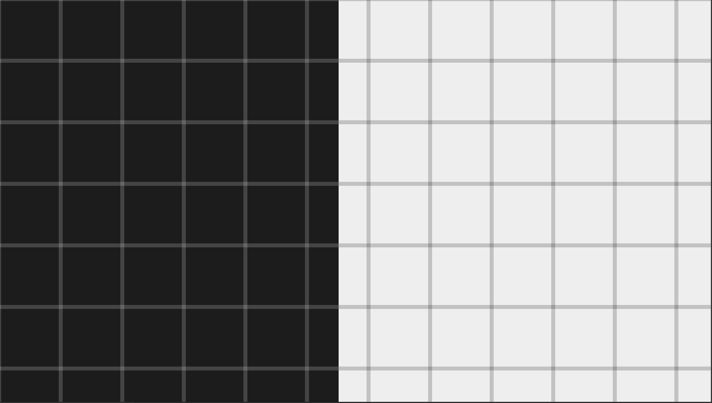
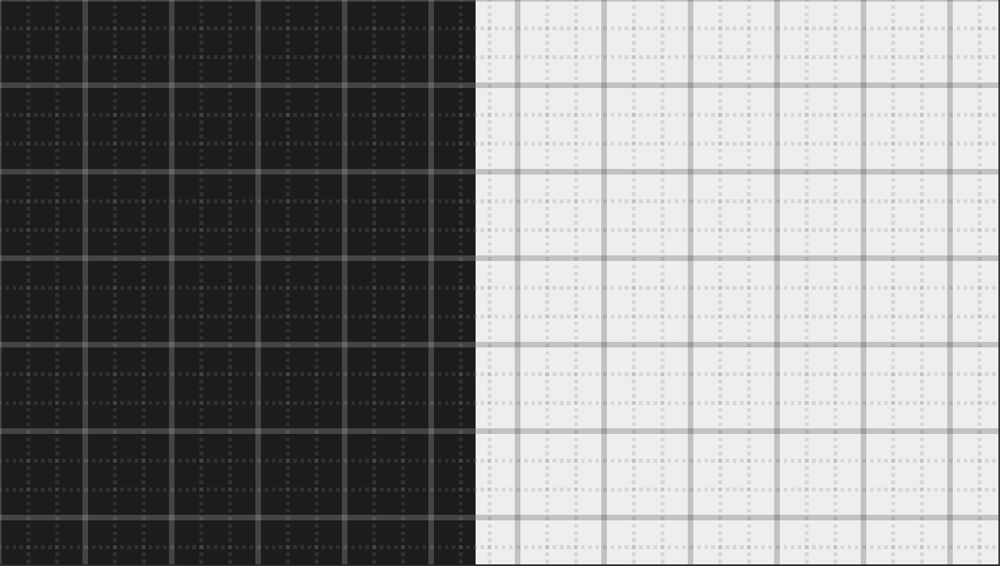
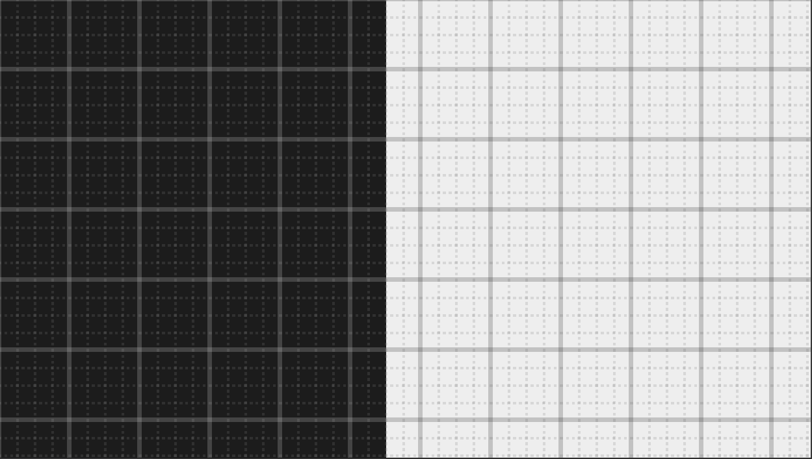
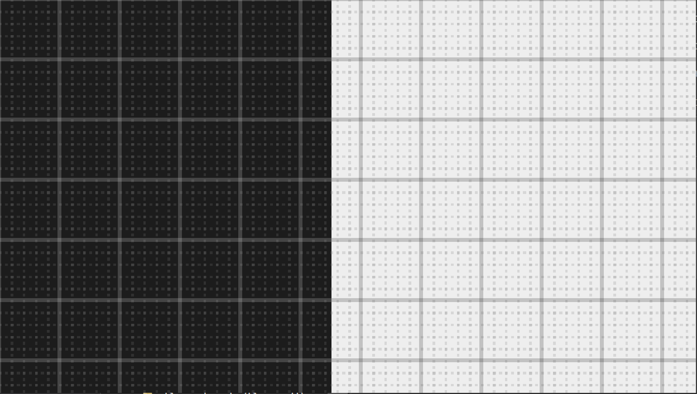
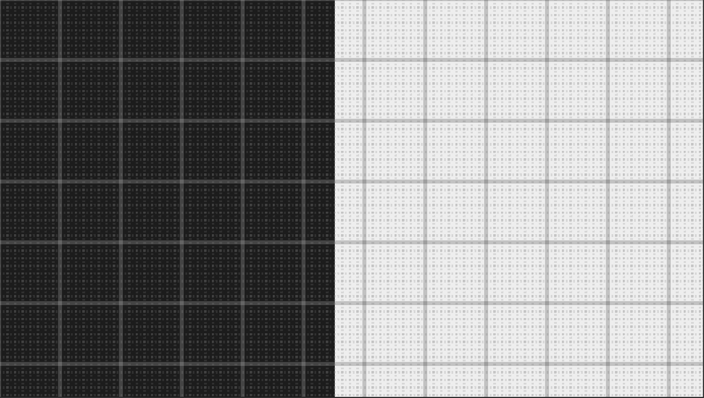

# Gridlines for Tailwind CSS

An experimental default experience for Tailwind CSS that uses gridlines and fractions for spatial reasoning.

**Note:** This is under active development and may be subject to breaking changes until it reaches a stable version 1.0.0. Not recommended for production yet but please play around if this idea resonates with you.

## What is this?

Gridlines for Tailwind CSS is a reimagining of Tailwind's spacing system inspired by grid paper. It consists of a single CSS variable added to the Tailwind base, a preset to change the spacing scale, and some overlay utilities to help visualize the new spacing values.

The core idea is to switch from reasoning about layout in absolute pixels to reasoning in ratios and fractions relative to your base grid cell size. This allows for creating responsive designs that can be scaled by changing one value - `theme.base` - which is useful for adapting to device contexts where the user can be very close to the screen, such as tablets and mobile phones, or very far from the screen, such as so-called '10-foot' UI for TV and advertising panels.

## Installation

Install with your favorite NodeJS package manager:

```bash
$ npm install tailwindcss-gridlines

$ yarn add tailwindcss-gridlines
```

Add to your Tailwind CSS config file:

```js
// tailwind.config.js

module.exports = {
  theme: {
    // ...
  },
  plugins: [
    require('tailwindcss-gridlines')
  ],
}
```

## New Utilities

### Base Grid Cell Size

The core unit of gridlines is your base grid cell size. You can think of this as the equivalent of the 1cm in centimetre graph paper. Changing this value scales your layout proportionally.

| Name | Size |
| ---- | ---- |
| base | 24px |

#### Customizing

You can customize the base unit by editing the `theme.base` value of your Tailwind config:

```js
// tailwind.config.js

module.exports = {
  theme: {
    base: '28px' // Changes the base grid cell size to 28px
  },
  // ...
}
```

You can make the base unit responsive using the breakpoint names defined in the `theme.screens` object as keys:

```js
// tailwind.config.js

module.exports = {
  theme: {
    base: {
      default: '20px', // Use a smaller grid cell size by default for smaller screens
      lg: '24px' // At the `lg` breakpoint, scale the grid size to 24px as these devices are probably held further away from the user
    }
  },
  // ...
}
```

### Gridlines

These utilities overlay a grid on top of an element to help aid the design process. They are  Put it on the `body` element to apply to the whole page.

| Class              | Preview                                                           |
| ------------------ | ----------------------------------------------------------------- |
| gridlines-dots     |     |
| gridlines-unit     |     |
| gridlines-thirds   |   |
| gridlines-quads    |    |
| gridlines-fifths   |   |
| gridlines-octs     |     |

#### Positioning

| Class                  | Value Applied To Gridlines           |
| ---------------------- | ------------------------------------ |
| gridlines-top-left     | `background-position: top left;`     |
| gridlines-left         | `background-position: left;`         |
| gridlines-bottom-left  | `background-position: bottom left;`  |
| gridlines-center       | `background-position: center;`       |
| gridlines-top-right    | `background-position: top right;`    |
| gridlines-right        | `background-position: right;`        |
| gridlines-bottom-right | `background-position: bottom right;` |

#### Note

This utility uses the `::after` pseudo-element to overlay the grid and is therefore incompatible with any utility or CSS that also uses the pseudo-element.

## Changed Utilities

### Spacing

Gridlines is a complete overhaul of the spacing system in Tailwind CSS. All plugins that inherit from the spacing scale will be affected, which includes `padding`, `margin`, `width`, `height`, `maxHeight`, `gap`, `inset`, `space`, and `translate` core plugins at the time of writing.

#### Relative To Base Grid Cell Size

We generate a proportional spacing scale as fractions of the base grid cell size. It is recommended to use Tailwind with JIT mode enabled to remove unused utilities.

| Name   | Size  | Pixels   |
| ------ | ----- | -------- |
| 0      | 0     | 0px      |
| px     | 1px   | 1px      |
| 1/8    | 0.125 | 3px      |
| 2/8    | 0.25  | 6px      |
| 3/8    | 0.375 | 9px      |
| 4/8    | 0.5   | 12px     |
| 5/8    | 0.625 | 15px     |
| 6/8    | 0.75  | 18px     |
| 7/8    | 0.875 | 21px     |
| 1/5    | 0.2   | 4.8px    |
| 2/5    | 0.4   | 9.6px    |
| 3/5    | 0.5   | 14.4px   |
| 4/5    | 0.8   | 19.12px  |
| 1/4    | 0.25  | 6px      |
| 2/4    | 0.5   | 12px     |
| 3/4    | 0.75  | 18px     |
| 1/3    | 0.333 | 7.992px  |
| 2/3    | 0.666 | 16.008px |
| 1/2    | 0.5   | 12px     |
| 1      | 1     | 24px     |
| 1-1/4  | 1.25  | 30px     |
| 1-2/4  | 1.5   | 36px     |
| 1-3/4  | 1.75  | 42px     |
| 1-1/2  | 1.5   | 36px     |
| 2      | 2     | 48px     |
| 2-1/4  | 2.25  | 54px     |
| 2-2/4  | 2.5   | 60px     |
| 2-3/4  | 2.75  | 66px     |
| 2-1/2  | 2.5   | 60px     |
| 3      | 3     | 72px     |
| 3-1/4  | 3.25  | 78px     |
| 3-2/4  | 3.5   | 84px     |
| 3-3/4  | 3.75  | 90px     |
| 3-1/2  | 3.5   | 84px     |
| 4      | 4     | 96px     |
| 4-1/4  | 4.25  | 102px    |
| 4-2/4  | 4.5   | 108px    |
| 4-3/4  | 4.75  | 114px    |
| 4-1/2  | 4.5   | 108px    |
| 5      | 5     | 120px    |
| 5-1/4  | 5.25  | 126px    |
| 5-2/4  | 5.5   | 132px    |
| 5-3/4  | 5.75  | 138px    |
| 5-1/2  | 5.5   | 132px    |
| 6      | 6     | 144px    |
| 6-1/4  | 6.25  | 150px    |
| 6-2/4  | 6.5   | 156px    |
| 6-3/4  | 6.75  | 162px    |
| 6-1/2  | 6.5   | 156px    |
| 7      | 7     | 168px    |
| 7-1/4  | 7.25  | 174px    |
| 7-2/4  | 7.5   | 180px    |
| 7-3/4  | 7.75  | 186px    |
| 7-1/2  | 7.5   | 180px    |
| 8      | 8     | 192px    |
| 8-1/4  | 8.25  | 198px    |
| 8-2/4  | 8.5   | 204px    |
| 8-3/4  | 8.75  | 210px    |
| 8-1/2  | 8.5   | 204px    |
| 9      | 9     | 216px    |
| 9-1/4  | 9.25  | 222px    |
| 9-2/4  | 9.5   | 228px    |
| 9-3/4  | 9.75  | 234px    |
| 9-1/2  | 9.5   | 228px    |
| 10     | 10    | 240px    |
| 11     | 11    | 264px    |
| 12     | 12    | 288px    |
| 13     | 13    | 312px    |
| 14     | 14    | 336px    |
| 15     | 15    | 360px    |
| 16     | 16    | 384px    |
| 17     | 17    | 408px    |
| 18     | 18    | 432px    |
| 19     | 19    | 456px    |
| 20     | 20    | 480px    |
| 25     | 25    | 600px    |
| 30     | 30    | 720px    |
| 35     | 35    | 840px    |
| 40     | 40    | 960px    |

#### Percentages

Percentage utilities have been renamed in two flavors depending on your preference: fractional and decimal.

##### Fractional

| Name       | Size       |
| ---------- | ---------- |
| 1/2%       | 50%        |
| 1/3%       | 33.333333% |
| 2/3%       | 66.666667% |
| 1/4%       | 25%        |
| 2/4%       | 50%        |
| 3/4%       | 75%        |
| 1/5%       | 20%        |
| 2/5%       | 40%        |
| 3/5%       | 60%        |
| 4/5%       | 80%        |
| 1/6%       | 16.666667% |
| 2/6%       | 33.333333% |
| 3/6%       | 50%        |
| 4/6%       | 66.666667% |
| 5/6%       | 83.333333% |
| 1/12%      | 8.333333%  |
| 2/12%      | 16.666667% |
| 3/12%      | 25%        |
| 4/12%      | 33.333333% |
| 5/12%      | 41.666667% |
| 6/12%      | 50%        |
| 7/12%      | 58.333333% |
| 8/12%      | 66.666667% |
| 9/12%      | 75%        |
| 10/12%     | 83.333333% |
| 11/12%     | 91.666667% |
| full       | 100%       |

##### Decimal

| Name   | Size       |
| ------ | ---------- |
| 8.33%  | 8.33%      |
| 10%    | 10%        |
| 16.66% | 16.666667% |
| 20%    | 20%        |
| 25%    | 25%        |
| 30%    | 30%        |
| 33.33% | 33.333333% |
| 40%    | 40%        |
| 41.66% | 41.666667% |
| 50%    | 50%        |
| 58.33% | 58.333333% |
| 60%    | 60%        |
| 66.66% | 66.666667% |
| 70%    | 70%        |
| 75%    | 75%        |
| 80%    | 80%        |
| 83.33% | 83.333333% |
| 90%    | 90%        |
| 91.66% | 91.666667% |
| 100%   | 100%       |
| full   | 100%       |

### Width / Max-Width / Min-Width

In addition to the spacing values above, the `width`, `max-width`, and `min-width` utilities also include each screen breakpoint and the following:

| Name       | Size       |
| ---------- | ---------- |
| 1/4-screen | 25vw       |
| 1/3-screen | 33vw       |
| 1/2-screen | 50vw       |
| 2/3-screen | 66vw       |
| 3/4-screen | 75vw       |
| screen     | 100vw      |

#### Width

These utilities are specific to `width`.

| Name | Size |
| ---- | ---- |
| auto | auto |

#### Min-Width

These utilities are specific to `min-width`.

| Name | Size        |
| ---- | ----------- |
| 0    | 0px         |
| min  | min-content |
| max  | max-content |


#### Max-Width

These utilities are specific to `max-width`.

| Name | Size |
| ---- | ---- |
| none | none |

### Height / Max-Height / Min-Height

In addition to the spacing values above, the `height`, `max-height`, and `min-height` utilities also include each screen breakpoint and the following:

| Name       | Size       |
| ---------- | ---------- |
| 1/4-screen | 25vh       |
| 1/3-screen | 33vh       |
| 1/2-screen | 50vh       |
| 2/3-screen | 66vh       |
| 3/4-screen | 75vh       |
| screen     | 100vh      |

#### Height

These utilities are specific to `height`.

| Name | Size |
| ---- | ---- |
| auto | auto |

#### Min-Height

These utilities are specific to `min-height`.

| Name | Size |
| ---- | ---- |
| 0    | 0px  |


#### Max-Height

These utilities are specific to `max-height`.

| Name | Size |
| ---- | ---- |
| none | none |

### Inset

In addition to the spacing values above, the `inset` utility also includes negative spacing values.

### Translate

In addition to the spacing values above, the `translate` utility also includes negative spacing values.

### Border Radius

Instead being named, Gridlines expresses border radii as a fraction of the base grid cell size.

| Name   | Size     | Pixels   |
| ------ | -------- | -------- |
| none   | 0        | 0px      |
| 1/8    | 0.125    | 3px      |
| 2/8    | 0.25     | 6px      |
| 3/8    | 0.375    | 9px      |
| 4/8    | 0.5      | 12px     |
| 5/8    | 0.625    | 15px     |
| 6/8    | 0.75     | 18px     |
| 7/8    | 0.875    | 21px     |
| 1/5    | 0.2      | 4.8px    |
| 2/5    | 0.4      | 9.6px    |
| 3/5    | 0.5      | 14.4px   |
| 4/5    | 0.8      | 19.12px  |
| 1/4    | 0.25     | 6px      |
| 2/4    | 0.5      | 12px     |
| 3/4    | 0.75     | 18px     |
| 1/3    | 0.333    | 7.992px  |
| 2/3    | 0.666    | 16.008px |
| 1/2    | 0.5      | 12px     |
| 1      | 1        | 24px     |
| 1-1/4  | 1.25     | 30px     |
| 1-2/4  | 1.5      | 36px     |
| 1-3/4  | 1.75     | 42px     |
| 1-1/2  | 1.5      | 36px     |
| 2      | 2        | 48px     |
| full   | 9999px   | 9999px   |

### Border Width

| Name    | Size     | Pixels   |
| ------- | -------- | -------- |
| default | 1px      | 1px      |
| 0       | 0        | 0px      |
| 1/8     | 0.125    | 3px      |
| 2/8     | 0.25     | 6px      |
| 3/8     | 0.375    | 9px      |
| 4/8     | 0.5      | 12px     |
| 5/8     | 0.625    | 15px     |
| 6/8     | 0.75     | 18px     |
| 7/8     | 0.875    | 21px     |
| 1/5     | 0.2      | 4.8px    |
| 2/5     | 0.4      | 9.6px    |
| 3/5     | 0.5      | 14.4px   |
| 4/5     | 0.8      | 19.12px  |
| 1/4     | 0.25     | 6px      |
| 2/4     | 0.5      | 12px     |
| 3/4     | 0.75     | 18px     |
| 1/3     | 0.333    | 7.992px  |
| 2/3     | 0.666    | 16.008px |
| 1/2     | 0.5      | 12px     |
| 1       | 1        | 24px     |

### Ring Offset

| Name    | Size     | Pixels   |
| ------- | -------- | -------- |
| 0       | 0        | 0px      |
| px      | 1px      | 1px      |
| 1/8     | 0.125    | 3px      |
| 2/8     | 0.25     | 6px      |
| 3/8     | 0.375    | 9px      |
| 4/8     | 0.5      | 12px     |
| 5/8     | 0.625    | 15px     |
| 6/8     | 0.75     | 18px     |
| 7/8     | 0.875    | 21px     |
| 1/5     | 0.2      | 4.8px    |
| 2/5     | 0.4      | 9.6px    |
| 3/5     | 0.5      | 14.4px   |
| 4/5     | 0.8      | 19.12px  |
| 1/4     | 0.25     | 6px      |
| 2/4     | 0.5      | 12px     |
| 3/4     | 0.75     | 18px     |
| 1/3     | 0.333    | 7.992px  |
| 2/3     | 0.666    | 16.008px |
| 1/2     | 0.5      | 12px     |
| 1       | 1        | 24px     |

### Ring Width

| Name    | Size     | Pixels   |
| ------- | -------- | -------- |
| 0       | 0        | 0px      |
| px      | 1px      | 1px      |
| 1/8     | 0.125    | 3px      |
| 2/8     | 0.25     | 6px      |
| 3/8     | 0.375    | 9px      |
| 4/8     | 0.5      | 12px     |
| 5/8     | 0.625    | 15px     |
| 6/8     | 0.75     | 18px     |
| 7/8     | 0.875    | 21px     |
| 1/5     | 0.2      | 4.8px    |
| 2/5     | 0.4      | 9.6px    |
| 3/5     | 0.5      | 14.4px   |
| 4/5     | 0.8      | 19.12px  |
| 1/4     | 0.25     | 6px      |
| 2/4     | 0.5      | 12px     |
| 3/4     | 0.75     | 18px     |
| 1/3     | 0.333    | 7.992px  |
| 2/3     | 0.666    | 16.008px |
| 1/2     | 0.5      | 12px     |
| 1       | 1        | 24px     |

### Line Height / Leading

Gridlines leaves the named relative line height utilities from Tailwind alone but replaces the absolute utilities with the fraction system. This change is useful for accurately aligning text within the grid cells.

| Name   | Size     | Pixels   |
| ------ | -------- | -------- |
| 1/8    | 0.125    | 3px      |
| 2/8    | 0.25     | 6px      |
| 3/8    | 0.375    | 9px      |
| 4/8    | 0.5      | 12px     |
| 5/8    | 0.625    | 15px     |
| 6/8    | 0.75     | 18px     |
| 7/8    | 0.875    | 21px     |
| 1/5    | 0.2      | 4.8px    |
| 2/5    | 0.4      | 9.6px    |
| 3/5    | 0.5      | 14.4px   |
| 4/5    | 0.8      | 19.12px  |
| 1/4    | 0.25     | 6px      |
| 2/4    | 0.5      | 12px     |
| 3/4    | 0.75     | 18px     |
| 1/3    | 0.333    | 7.992px  |
| 2/3    | 0.666    | 16.008px |
| 1/2    | 0.5      | 12px     |
| 1      | 1        | 24px     |
| 1-1/4  | 1.25     | 30px     |
| 1-2/4  | 1.5      | 36px     |
| 1-3/4  | 1.75     | 42px     |
| 1-1/2  | 1.5      | 36px     |
| 2      | 2        | 48px     |

### Text Indent

Since indenting is based on line-height values in Tailwind, these have the same values as above as well as the negations of each.

## Contributing

Feedback is welcome, please use GitHub issues appropriately. This idea has been rattling around in my head since 2018 so fresh perspectives may lead to greater insight.

If suggesting any major changes please make sure it is well reasoned and in line with the core principles of this project. Understand I am one busy person and require a description of the problem and a compelling argument for the proposed solution in order to consider it properly. 

## License

Gridlines for Tailwind CSS is [MIT](LICENSE) licensed.